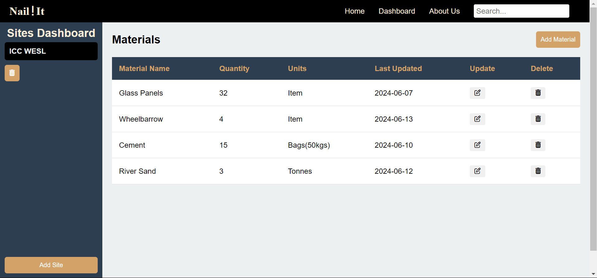
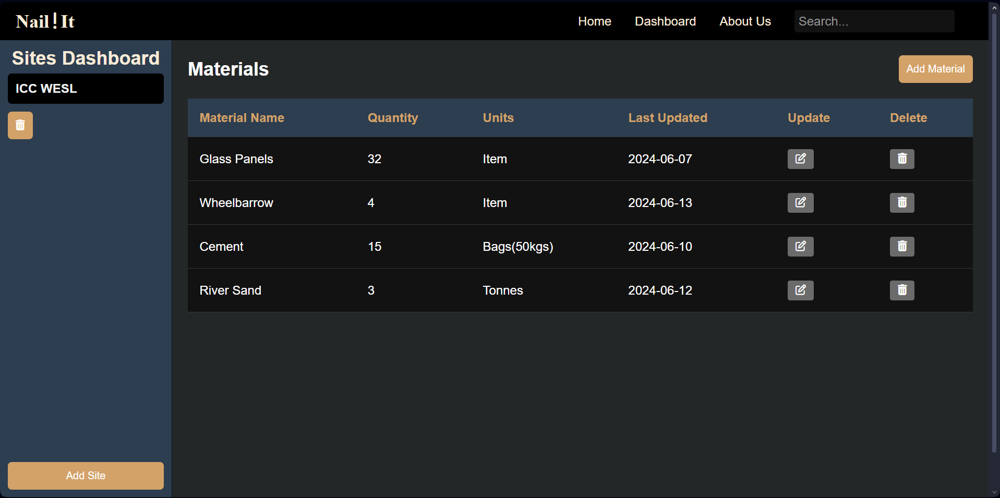

# Nail-It

  

## Introduction

Nail-It is a construction site stock taking application, able to store the materials record on site for different sites. 

## Authors

* Mwandoe S. Xavier [@Mwandoe-Shali](https://github.com/Mwandoe-Shali)
* Ronald M. Mwau [@Aimron001](https://github.com/Aimron001)

## Link to Demo Web Application

[Nail-It](https://nail-it-sandy.vercel.app/)

*Hosted on Vercel at the moment.*

## Usage

The web application is straight forward to use:

1. Navigate to the dashboard page
2. At the left bottomest part of the screen, click the **Add Site** button
3. Fill in the displayed form including the *Site Name, Site Location, Type of Building & Date* and click **Submit**
4. On the dashboard side, click on the site name (It should have a different background color from other sites i.e black)
5. Once in the site choosen, click on the **Add Material** button on the right top part below the header to add the materials.
6. Fill in with the desired material from the displayed form including the *Material Name, Quantity, Units(kgs, number, metres etc), & Date* and click **Submit**
7. Now you can be able to see the materials. Go ahead and play with the application.
8. At the same line of the material name, click the **Pen & Paper** icon to edit the material. 
9. Click on the **Delete** icon to delete the material.
10. And if you want to delete the entire site find the **Delete** icon next to the sitename, click on it and confirm *Yes* to delete a site and associated materials.

## Contributing

A huge shout out to my guy [@Aimron001](https://github.com/Aimron001) for the Javascript code and advise especially in utilising Firebase as a beginner friendly database.

## Licensing

MIT License:

>Do whatever you like with the code, I embrace open-source as a way for the community to benefit at large. A shout-out too will be appreciated for the sleepless nights coming up with it.

## Blog Article (*For the Tech Savvy...*)

[Nail-It: The Tech-Truth](https://mwandoe.hashnode.dev/nail-it-the-tech-truth)

